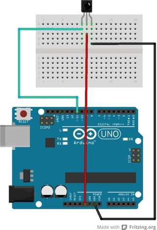

# Control Remoto Infra Rojo
Fuente:
http://www.instructables.com/id/Arduino-Infrared-Remote-tutorial/

## Montaje

Nota: Si se mira el sensor de frente, el sensor de esta imágen tiene invertida la polaridad de la alimentación respecto del sensor que utilizaremos en el curso.



## Librería
https://github.com/z3t0/Arduino-IRremote

## Código de ejemplo

```C
#include <IRremote.h>

int RECV_PIN = 11;
IRrecv irrecv(RECV_PIN);
decode_results results;

void setup()
{
  Serial.begin(9600);
  irrecv.enableIRIn(); // Start the receiver
}

void loop()
{
  if (irrecv.decode(&results))
    {
     Serial.println(results.value, HEX);
     irrecv.resume(); // Receive the next value
    }
}
```
