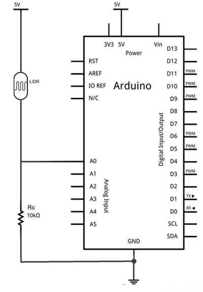
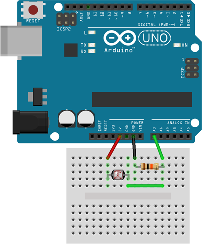

# LDR -

Fuente: https://www.luisllamas.es/medir-nivel-luz-con-arduino-y-fotoresistencia-ldr/


## Esquemático



## Montaje


## Código de ejemplo


```C
const int LEDPin = 13;
const int LDRPin = A0;
const int threshold = 100;

void setup() {
   pinMode(LEDPin, OUTPUT);
   pinMode(LDRPin, INPUT);
}

void loop() {
   int input = analogRead(LDRPin);
   if (input > threshold) {
      digitalWrite(LEDPin, HIGH);
   }
   else {
      digitalWrite(LEDPin, LOW);
   }
}
```
