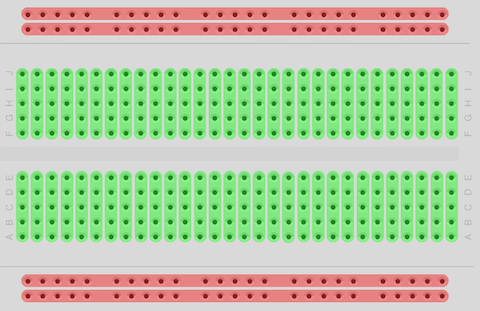
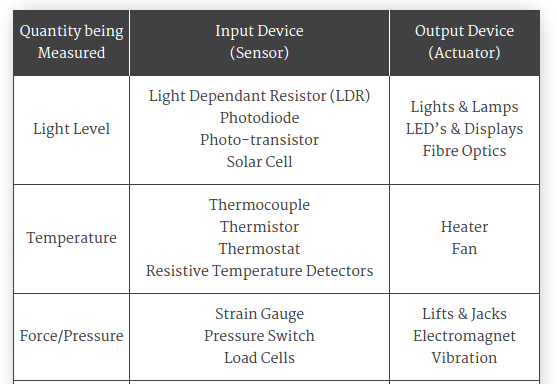
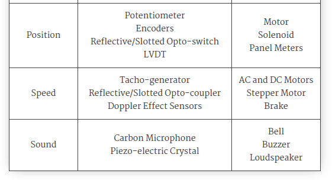
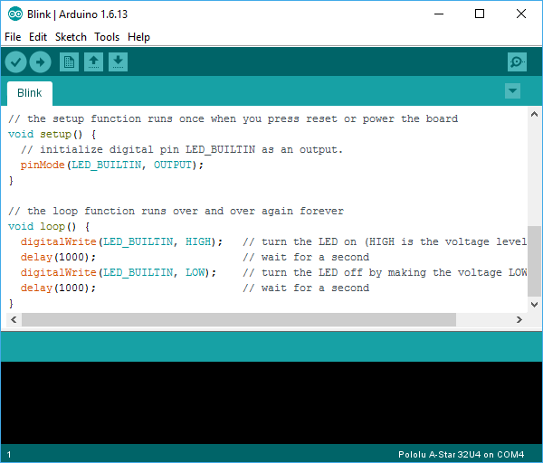
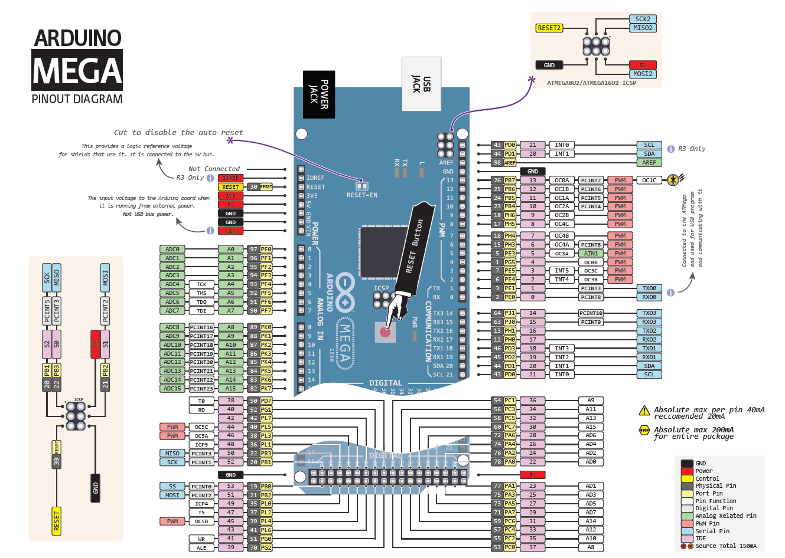
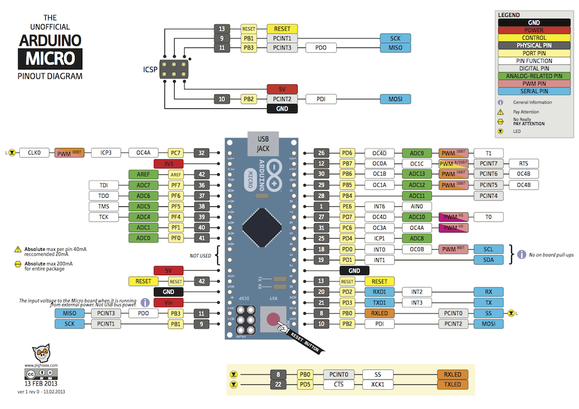
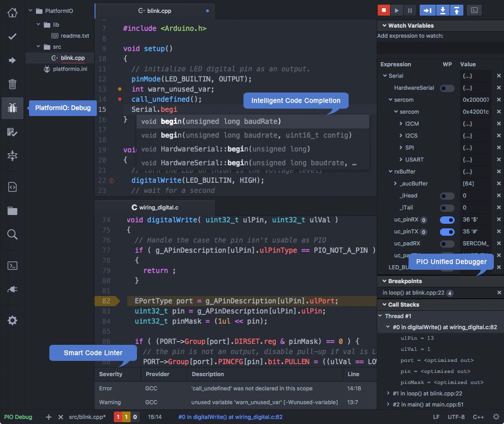

<!-- slide -->
# Fundamentos de IoT

17 de Octubre 2017
Encuentro 1

---
Fabián Ramírez
framirez@vates.com

<!-- slide -->
## Contenidos

- Conceptos de electrónica
- Tipos de sensores y actuadores
- Arduino
- Prácticas con Arduino

<!-- slide -->
## Conceptos de electrónica

- Hardware-101: https://developer.android.com/things/hardware/hardware-101.html

<!-- slide -->
### Power supply
- $V_{IN}$
- $V_{CC}$ o $V_{DD}$
- Ground o Tierra ($GND$)

<!-- slide -->
### Entradas y Salidas Digitales
- Niveles TTL (5V)
- Niveles CMOS (3.3V)
----
#### Valores lógicos

  - High (> 2.0V)  
  - Low (< 0.8V)  

<!-- slide -->
### Entradas y Salidas Analógicas

- ADC (Analog to Digital Converter)
- DAC (Digital to Analog Converter)

---

#### Resolución
- 10 bit ADC ($2^{10}$ valores entre 0 y 1023)

<!-- slide -->
### Acondicionamiento de señales
- Amplificación
- Filtrado
- Offset

<!-- slide -->
### Breadboards

<!-- slide -->
## Tipos de sensores y actuadores

http://www.electronics-tutorials.ws/io/io_1.html

<!-- slide -->

<!-- slide -->
## Arduino
https://www.arduino.cc/

- Open Hardware
- Open Software

<!-- slide -->
### IDE Arduino

Instalación del IDE Oficial de Arduino

<!-- slide -->
### Arduino UNO

<!-- slide -->
### Arduino Nano

<!-- slide -->
### Arduino Leonardo

<!-- slide -->
### Arduino Mega

<!-- slide -->
### Arduino Micro

<!-- slide -->
## PlatformIO

http://platformio.org/
PlatformIO IDE for IoT development

<!-- slide -->
## Prácticas con Arduino

- LEDs
- Pulsadores
- Display LCD
- LDR
- Buzzer
- Sensor Ultrasónico
- Sensor Infrarojo
