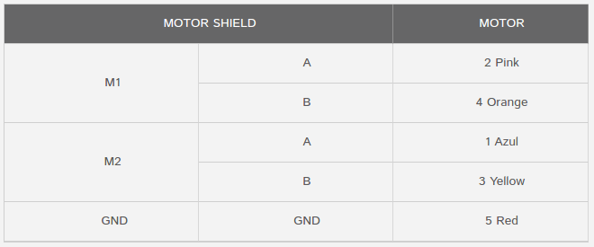
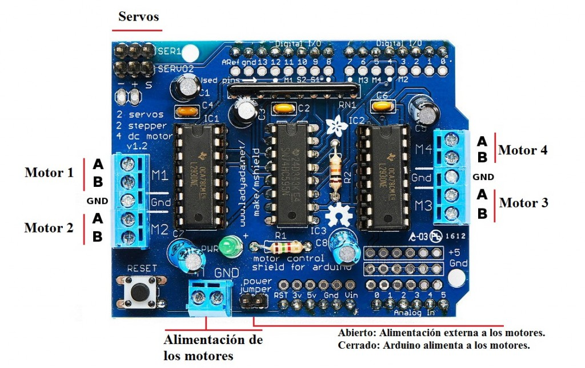
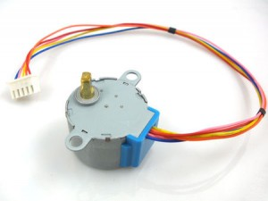

# Motor Shield V1

## Fuente
https://www.prometec.net/motor-shield-stepper

Fuente:
http://www.instructables.com/id/Arduino-Infrared-Remote-tutorial/

## Esquemático



## Montaje






## Librería

https://www.prometec.net/wp-content/uploads/2015/07/adafruit-Adafruit-Motor-Shield-library-1.0.0-0-g89a0973.zip

## Código de ejemplo

```C
#include <Arduino.h>
#include <AFMotor.h>

AF_Stepper motor(256, 1);              // A la puerta M1 M2


void setup() {
  Serial.begin(9600);
  Serial.println("Stepper test!");
  motor.setSpeed(50); // 50 rpm
}

void loop() {
  Serial.println("Single coil steps");
  motor.step(2000, FORWARD, SINGLE);
  motor.step(1000, BACKWARD, SINGLE);
  delay(1000);

  Serial.println("Double coil steps");
  motor.step(2000, FORWARD, DOUBLE);
  motor.step(1000, BACKWARD, DOUBLE);
  delay(1000);

  Serial.println("Interleave coil steps");
  motor.step(2000, FORWARD, INTERLEAVE);
  motor.step(1000, BACKWARD, INTERLEAVE);
  delay(1000);

  Serial.println("Micrsostep steps");
  motor.step(2000, FORWARD, MICROSTEP);
  motor.step(1000, BACKWARD, MICROSTEP);
  delay(1000);
}
```
