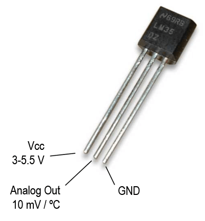
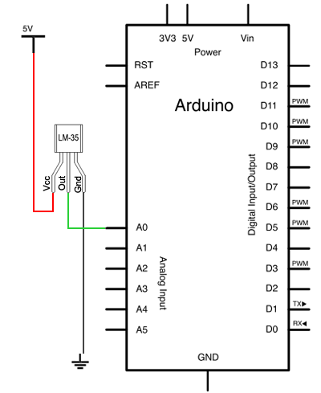
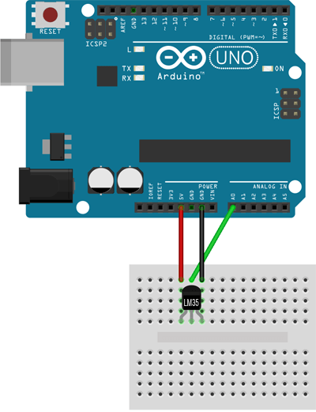

# Temperatura LM35

Fuente: https://www.luisllamas.es/medir-temperatura-con-arduino-y-sensor-lm35/

## Esquemático





## Montaje



## Código de ejemplo


```C
const int sensorPin= A0;

void setup()
{
  Serial.begin(9600);
}

void loop()
{
  int value = analogRead(sensorPin);
  float millivolts = (value / 1023.0) * 5000;
  float celsius = millivolts / 10;
  Serial.print(celsius);
  Serial.println(" C");
  delay(1000);
}```
