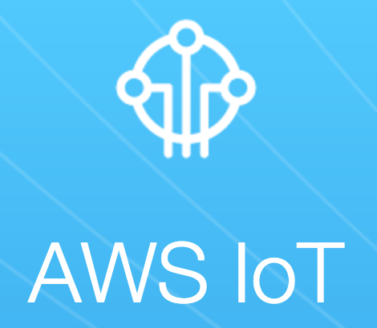
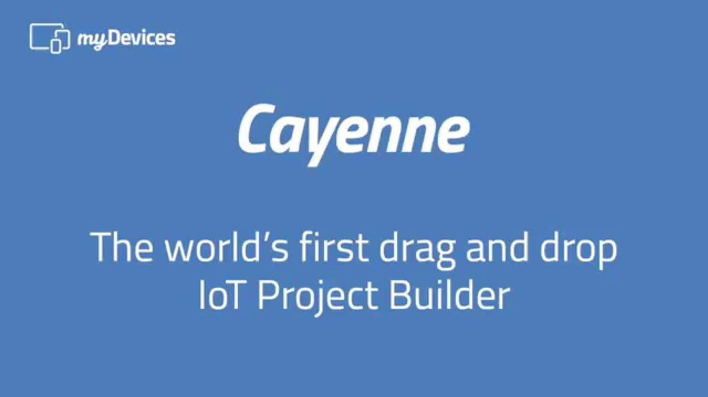
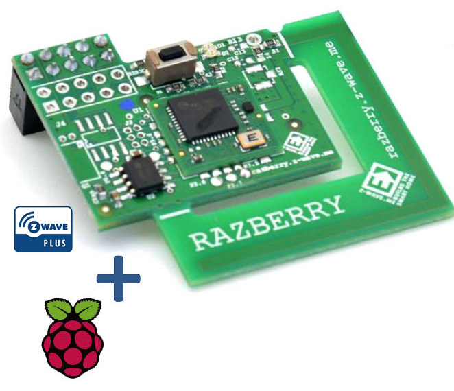
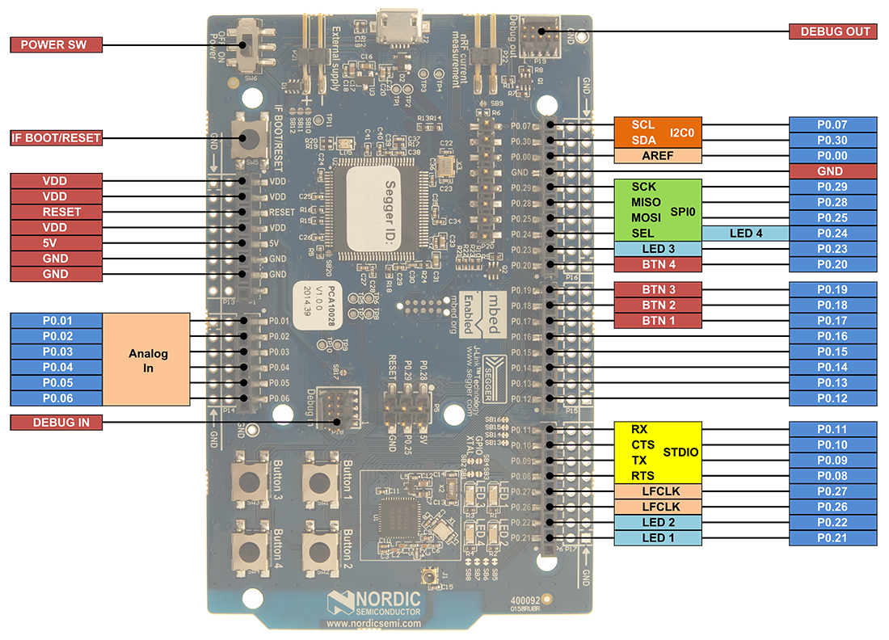

<!-- slide -->
# Fundamentos de IoT

31 de Octubre 2017
Encuentro 5

---
Fabián Ramírez
framirez@vates.com

---
https://github.com/fa2r/iot

<!-- slide -->
## Contenidos

- AWS IoT
- Cayenne
- Losant
- Eclipse Kura
- OpenHab
- IFTTT

<!-- slide -->
### AWS IoT

<!-- slide -->
### Cayenne
https://mydevices.com/

<!-- slide -->
### Losant
https://www.losant.com/

<!-- slide -->
### Eclipse Kura

<!-- slide -->
### OpenHab

#### Live Demo
- http://demo.openhab.org:8080

#### OpenHABian para Raspberry Pi
- https://github.com/openhab/openhabian/releases

<!-- slide -->
### OpenHab

Acceso a OpenHab en Raspberry Local
http://192.168.80.139:8080

Acceso WEB:
https://myopenhab.org/

<!-- slide -->
### OpenHab

#### MQTT Binding
https://agrinode.github.io/docs/openhab2_mqtt/

<!-- slide -->
## IFTTT
If This Then That
https://platform.ifttt.com/

<!-- slide -->
### IFTTT
If This Then That
- WebHooks https://maker.ifttt.com

<!-- slide -->
# Z-Wave
https://razberry.z-wave.me/

<!-- slide -->
# Bluetooth
Nordic NRF51-DK
https://www.nordicsemi.com/eng/Products/nRF51-DK

